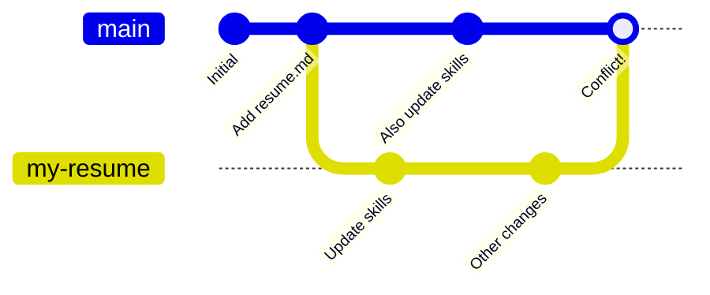

## ステップ 1: マージコンフリクトについて学ぶ

### マージコンフリクトとは

**マージコンフリクト**は、2 つの異なるブランチで、同じファイルの同じ箇所に変更が加えられたときに発生します。

**ここで起きていること:**

1. リポジトリを用意し、`resume.md` ファイルを追加します。
2. `my-resume` という新しいブランチを作成し、スキル欄を更新します。
3. 同じタイミングで、別の人も `main` ブランチ上でスキル欄を更新します。
4. `my-resume` ブランチに、関係のない別の変更も追加します。
5. `my-resume` を `main` にマージしようとすると、**コンフリクト**が発生します。両方のブランチが `resume.md` の同じ箇所を変更しているためです。

### アクティビティ: Pull request を作成する

すぐに練習できるように、この演習ではあらかじめ `my-resume` ブランチを作成し、`resume.md` を両方のブランチで変更してあります。この状態はコンフリクトを発生させます。実際に試してみましょう。

1. このリポジトリを新しいブラウザタブで開きます。このタブで手順を読みながら、もう一方のタブで作業してください。

1. 上部ナビゲーションで **Pull requests** タブを選択します。

1. **New pull request** ボタンをクリックし、次の設定を使います。

   - Base: `main`
   - Compare: `my-resume`
   - Title: `マージコンフリクトを解決する`

1. 新しい pull request を開くと、Mona が次のステップを投稿します。
