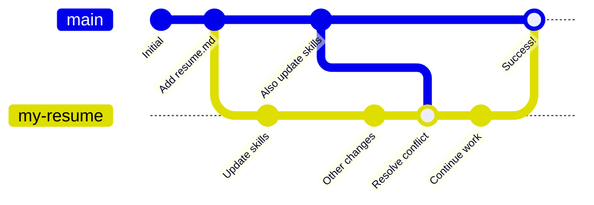

## ステップ 2: マージコンフリクトを解決する

コンフリクトの管理は少し怖く感じるかもしれません。でも心配しなくて大丈夫です。Git はマージをかなり賢く扱えます。人の判断が必要になるのは、状況がとても曖昧なときだけです。

コンフリクトを処理するときは、一般的に次の 3 つの選択肢があります。

1. base ブランチのバージョンを採用する。
1. compare ブランチのバージョンを採用する。
1. 両方のブランチの変更を手動で組み合わせる。

> [!TIP]
> コンフリクトの扱いについて詳しく知りたい場合は、[GitHub Docs: resolve the conflict](https://docs.github.com/en/pull-requests/collaborating-with-pull-requests/addressing-merge-conflicts/resolving-a-merge-conflict-using-the-command-line) を参照してください。

### いつコンフリクトを解決すべきか

コンフリクトは、気づいた時点で解決できます。GitHub でコンフリクトを解決しても、pull request が自動的にマージされるわけではありません。代わりに、コンフリクトの解決内容が **reverse merge** コミットとして保存され、通常どおりブランチで作業を続けられます。

つまり、`base` ブランチ (`main`) の一部の変更が、`compare` ブランチ (`my-resume`) に取り込まれます。更新されるのは `compare` ブランチだけなので、マージ前に解決済みの変更をテストできます。



### アクティビティ: マージコンフリクトを解決する

1. 必要であれば、先ほど作成した pull request を開きます。

1. ページ下部までスクロールします。マージボタンの近くに、解決すべきコンフリクトがあることを示すメッセージが表示されます。

1. **Resolve conflicts** ボタンを押し、マージコンフリクトを処理するための特別なテキストエディタを開きます。

1. 次のようなハイライトされた範囲を探します。ここには、コンフリクトしている両方のバージョンが表示されています。

   ```txt
   <<<<<<< my-resume
   - オープンソースプロジェクトに貢献
   =======
   - 社内ツールを構築
   >>>>>>> main
   ```

1. 今回は compare ブランチのバージョンを残すことにします。`=======` から `>>>>>>> main` までの内容を削除し、base ブランチ側のバージョンを取り除きます。

   ```txt
   <<<<<<< my-resume
   - オープンソースプロジェクトに貢献
   =======
   >>>>>>> main
   ```

1. 手動での変更が終わったら、マージコンフリクトのマーカーを削除します。compare ブランチ側の内容だけが残ります。

   ```txt
   - オープンソースプロジェクトに貢献
   ```

1. 右上の **Mark as resolved** ボタンをクリックし、**Commit merge** を選択します。

1. コンフリクトを解決すると、Mona が次のステップを投稿します。
